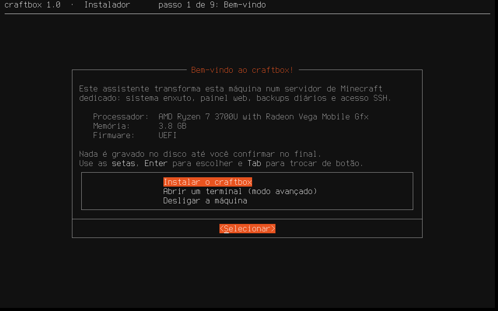
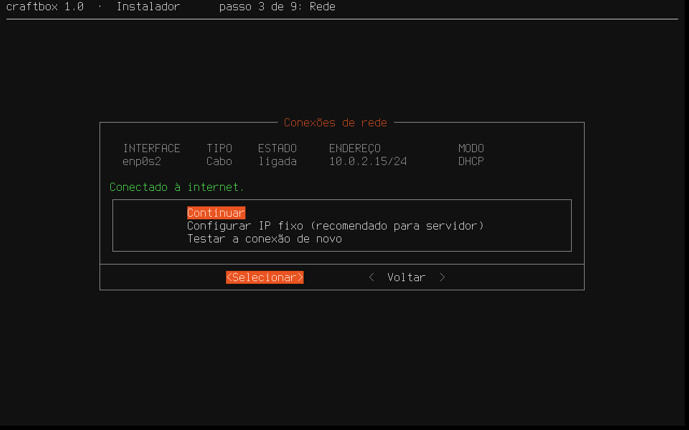
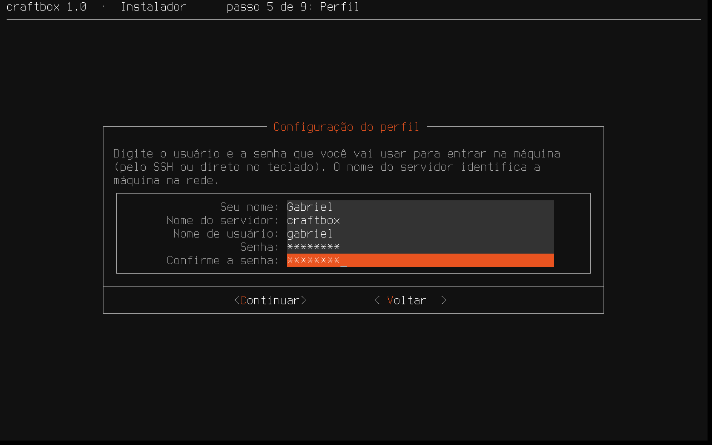
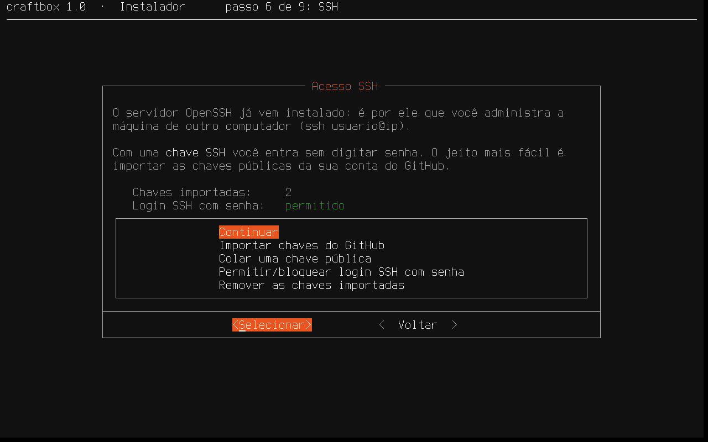
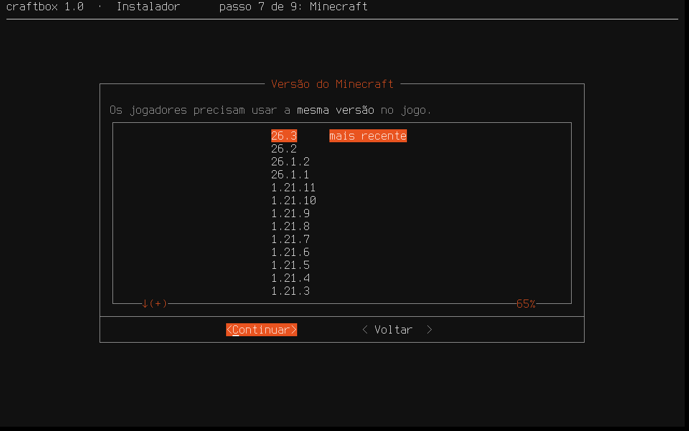
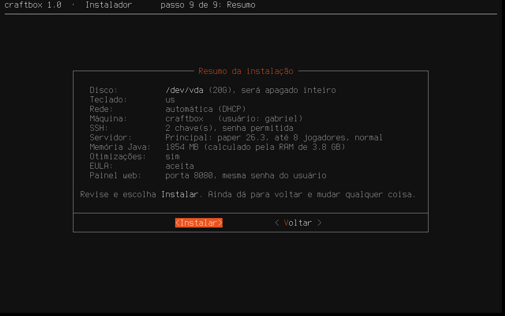
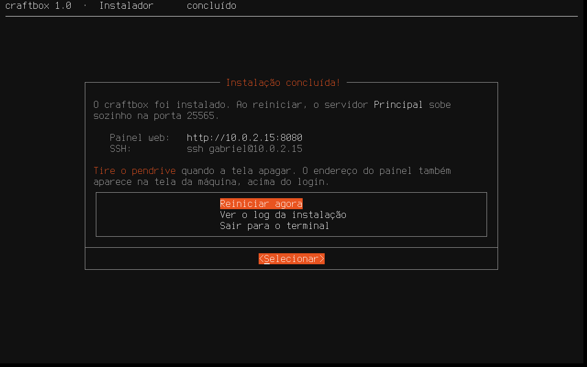
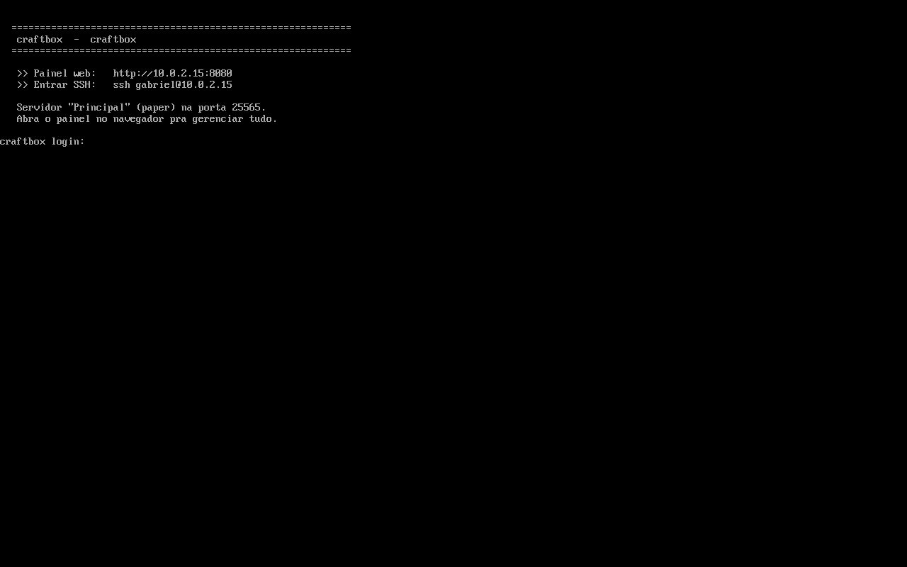
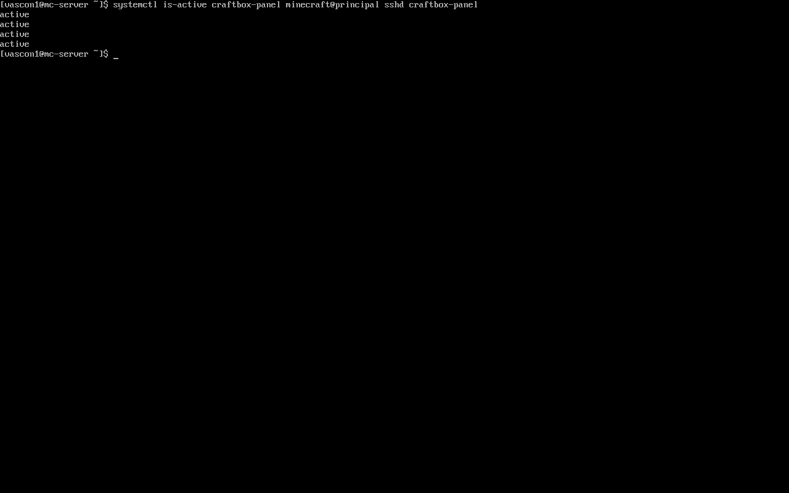

# Instalando o craftbox 🧱

Guia passo a passo pra transformar um notebook/PC antigo (UEFI) num servidor de
Minecraft com o craftbox. Do pendrive ao primeiro login no painel.

> ⚠️ **A instalação APAGA o disco inteiro da máquina de destino.** Faça backup do
> que importa antes. É pra ser um servidor dedicado.

---

## 1. O que você precisa

- A **ISO do craftbox** — baixe em [Releases](https://github.com/Vascon11/craftbox/releases) (ou compile com `./build.sh`).
- Um **pendrive** (≥ 2 GB) — que vira o instalador.
- A **máquina de destino** com **boot UEFI** e **internet** (cabo de rede é o mais tranquilo; Wi-Fi também dá).
- Alguns minutos. ☕

---

## 2. Gravar a ISO no pendrive

### Opção A — Ventoy (recomendada) 🟢

O [Ventoy](https://www.ventoy.net) transforma o pendrive num "menu de ISOs": você
copia a ISO como um arquivo normal e escolhe ela no boot. Melhor porque o pendrive
continua usável pra outras ISOs e pra guardar arquivos.

1. Baixe o Ventoy e instale no pendrive **uma vez** (isso formata o pendrive):
   - Linux: baixe o `ventoy-x.y.z-linux.tar.gz`, extraia e rode `sudo ./Ventoy2Disk.sh -i /dev/sdX` (troque `sdX` pelo seu pendrive — confira com `lsblk`).
   - Windows: abra o `Ventoy2Disk.exe`, selecione o pendrive e clique **Install**.
2. Depois de instalado, o pendrive tem uma partição grande. **Copie a ISO do craftbox pra dentro dela** (arrastar e soltar, como qualquer arquivo).
3. Pode copiar várias ISOs — o Ventoy mostra um menu na hora do boot.

### Opção B — Gravar direto (dd / Fedora Media Writer / balenaEtcher)

Se preferir um pendrive dedicado só pro craftbox:

```bash
lsblk -dpo NAME,SIZE,MODEL          # ache seu pendrive (ex: /dev/sdb)
sudo dd if=craftbox-*.iso of=/dev/sdX bs=4M status=progress oflag=sync
```

> ⚠️ `dd` no disco errado apaga tudo. **Confirme o device com `lsblk` antes.**
> Alternativas gráficas: **Fedora Media Writer**, **balenaEtcher**, **GNOME Discos**.

---

## 3. Bootar a máquina pelo pendrive

1. Espete o pendrive na máquina de destino.
2. Ligue e abra o **menu de boot** (tecla varia por fabricante, aperte repetidamente ao ligar):
   - Dell: **F12** · HP: **F9** · Lenovo: **F12** · Acer: **F12** · ASUS: **Esc/F8**
3. Escolha o pendrive (algo como *"UEFI: <marca do pendrive>"*).
4. **Se for Ventoy:** aparece o menu do Ventoy → escolha a **ISO do craftbox** → dê Enter (pode escolher "Boot in normal mode").
5. O Arch live carrega e o **instalador do craftbox abre sozinho**.

> Se não aparecer o pendrive no menu de boot, entre na BIOS/UEFI e desative o
> **Secure Boot** (o Arch live não é assinado).

---

## 4. A interface do instalador (passo a passo)

O instalador (`mc-install`) é um assistente em tela cheia, no estilo do instalador do
**Ubuntu Server**: uma tela por etapa, com **Continuar** e **Voltar**. Use as **setas** para
escolher, **Enter** para confirmar e **Tab** para trocar de botão. **Nada é gravado no disco
até a confirmação final**, então dá pra voltar e mudar qualquer coisa.



1. **Bem-vindo**: mostra processador, memória e se a máquina bootou em UEFI (obrigatório).
   Também dá pra abrir um terminal ou desligar.
2. **Teclado**: escolha o layout (ABNT2 é o padrão). Ele vale na hora, e a tela seguinte
   tem uma caixa pra testar os acentos.
3. **Rede**: lista as placas de rede com o IP de cada uma e testa a internet. Com cabo, é só
   **Continuar**. Sem cabo, **Conectar a uma rede Wi-Fi** procura as redes e pede a senha.
   **Configurar IP fixo** deixa o servidor sempre no mesmo endereço (recomendado pra redirecionar
   portas no roteador). Wi-Fi e IP fixo ficam salvos no sistema instalado.

   

4. **Armazenamento**: escolha o disco (o pendrive de boot nem aparece). O craftbox usa o **disco
   inteiro**: a tela seguinte mostra o que será criado (partição EFI + ext4 + swap de 2 GB) e,
   em vermelho, o que será **apagado**.
5. **Perfil**: seu nome, o nome da máquina na rede, o usuário e a senha (pelo menos 6 caracteres)
   para entrar por SSH ou no teclado.

   

6. **SSH**: o OpenSSH já vem instalado. Dá pra **importar as chaves públicas do GitHub** (só
   digitar seu usuário) ou colar uma chave; com chave, você pode **bloquear o login por senha**.

   

7. **Minecraft**: tipo (**Paper** = plugins, leve · **Fabric** = mods), **versão** (lista oficial,
   a mais recente vem marcada), nome, mensagem (MOTD), máximo de jogadores, dificuldade,
   **otimizações pra hardware fraco** e a **EULA da Mojang**. Forge, NeoForge e modpacks você
   cria depois pelo painel.

   

8. **Painel web**: usar a **mesma senha do usuário** ou definir outra. É a senha de
   `http://<ip>:8080`.
9. **Resumo**: tudo o que foi escolhido, inclusive a memória do Java calculada pela RAM. Depois de
   **Instalar**, uma última tela pede a confirmação de que o disco será apagado (o botão
   padrão é **Voltar**, de propósito).

   

A instalação mostra as etapas (particionar, formatar, sistema base, Minecraft, configuração,
boot) com uma barra de progresso e as últimas linhas do log (uns minutos, mais lento em HD).
Se algo falhar, a tela de erro mostra o motivo e deixa ver o log completo ou voltar ao resumo
pra tentar de novo. O log fica salvo em `/var/log/craftbox-install.log` no sistema instalado.

No fim, ele mostra o endereço do painel e do SSH e oferece **reiniciar**. Tire o pendrive
quando a tela apagar.



> Pra só conhecer as telas sem instalar nada, rode `mc-install --dry-run` (simula a instalação,
> não toca em disco nenhum).

---

## 5. Depois de instalado

Ao reiniciar, sozinho no boot: o **servidor sobe** na porta **25565** e o **painel web** fica no ar. Validado numa VM UEFI — os serviços sobem no boot:

Na tela da máquina, acima do login, aparecem o endereço do painel e o comando de SSH:





### Acessar o painel (jeito principal)

No navegador de qualquer PC/celular na **mesma rede**:

```
http://<ip-do-servidor>:8080
```

Entre com a **senha do painel** que você definiu. Dali você liga/desliga o servidor,
instala mods/plugins, cria outros servidores, vê o console e os backups, etc.

> **Qual é o IP?** O painel/servidor mostra no boot, ou descubra pelo roteador. Por
> SSH: `ip -4 addr`. Dica: fixe um IP pra ele no roteador (DHCP reservation).

### Por SSH (linha de comando)

```bash
ssh SEU_USUARIO@IP_DO_SERVIDOR
systemctl status minecraft@principal        # status da instância
journalctl -u minecraft@principal -f        # log ao vivo
sudo systemctl restart minecraft@principal  # reiniciar
systemctl status craftbox-panel             # o painel web
```

Cada servidor é uma instância `minecraft@<nome>`, com os arquivos em
`/srv/minecraft/<nome>/`. O painel gerencia todas.

### Entrar no jogo

No Minecraft (Java), **Multijogador → Adicionar servidor**, endereço
`IP_DO_SERVIDOR:25565`. Pra jogar de fora de casa sem mexer no roteador, use a aba
**Integrações** do painel (playit.gg ou Tailscale).

---

## 6. Problemas comuns

- **Não bota pelo pendrive** — abra a BIOS e desative o **Secure Boot**; confira se o boot é **UEFI**.
- **"Sem internet" no instalador**: conecte o cabo de rede (mais simples) ou use **Conectar a uma rede Wi-Fi** na tela de Rede.
- **"BIOS legado (não suportado)" na tela inicial**: entre no setup da BIOS e troque o boot para **UEFI** (desligue Legacy/CSM).
- **5 beeps ao ligar (Dell)** — bateria da BIOS (CR2032) fraca; troque a moeda. Não impede instalar.
- **Servidor não inicia** — no painel, aba **Console**, veja o log. Versões muito novas do MC exigem Java novo; o craftbox já instala o Java certo.
