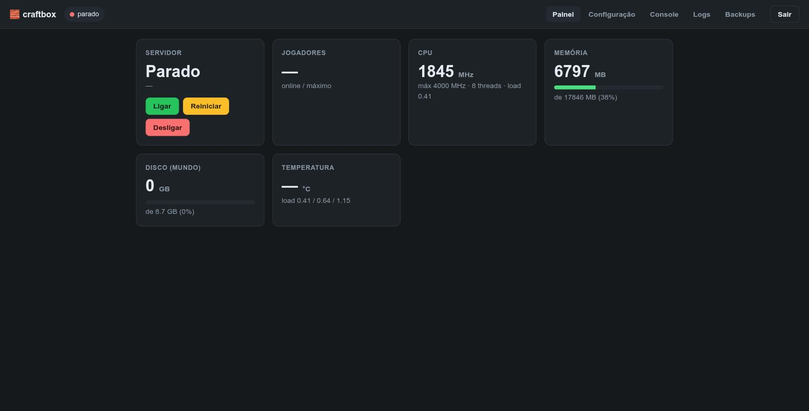
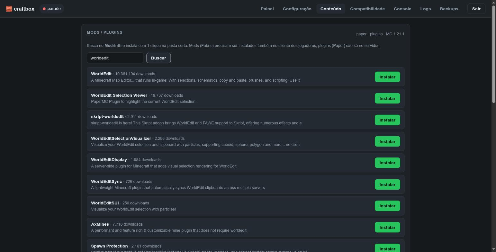
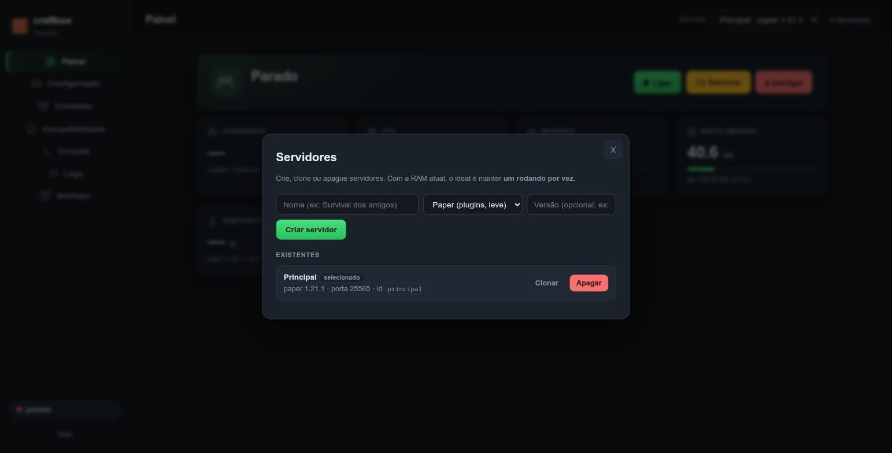
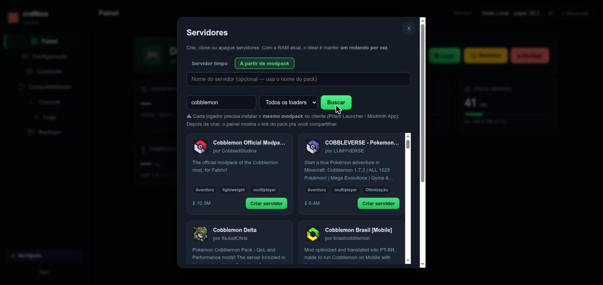

<p align="center">
  
</p>

<h1 align="center">craftbox</h1>

<p align="center"><b>Uma mini-distro Linux que transforma um notebook velho num servidor de Minecraft dedicado.</b></p>

`craftbox` é um *spin* enxuto do [Arch Linux](https://archlinux.org): você grava a ISO num pendrive, dá boot, responde algumas perguntas, e no fim tem uma máquina headless que existe pra uma coisa só — rodar um servidor de Minecraft (Paper, Fabric ou o experimental Pumpkin) que sobe sozinho no boot.

Sem ambiente gráfico, sem peso: toda a RAM sobra pro jogo.


---

## Interface — painel web `craftbox-panel`

O craftbox vem com um **painel web** (**Node.js puro, zero dependências**) pra gerenciar tudo pelo navegador, com cara de painel de hosting profissional e login por senha. Veja [`panel/`](panel/).



- 🖥️ **Multi-servidor** — crie/clone/apague vários servidores (**Paper**, **Fabric** ou **Pumpkin** — servidor em Rust, experimental), cada um com loader, versão e porta próprios; troca entre eles por um seletor. Filosofia "um rodando por vez" pra hardware fraco.
- 📊 **Painel** — status (no ar/desligado), jogadores online (RCON) e stats em tempo real: frequência de CPU, RAM, disco, temperatura, load, **peso do mundo** e **velocidade da internet** (sob demanda).
- ⏻ **Ligar / reiniciar / desligar** via systemd (ou `systemctl --user`, modo **rootless** sem sudo).
- 🧩 **Loja de mods/plugins** estilo Prism/Modrinth — busca no [Modrinth](https://modrinth.com) com ícones, categorias e ordenação, **escolha de versão**, **dependências automáticas** e gestão dos instalados (ativar/desativar, atualizar, remover).
- 📦 **Modpacks** — cria um servidor a partir de um modpack do Modrinth (`.mrpack`) em **Fabric/Quilt/Forge/NeoForge**: baixa os mods **em paralelo** (com **tela de carregamento** e progresso), **desativa sozinho os mods client-only** que derrubariam um servidor dedicado, monta a instância e mostra o link do pack pros jogadores instalarem o mesmo no cliente.
- 🌐 **Integrações / Rede** — conecte o servidor sem abrir porta no roteador: **playit.gg** (túnel), **Cloudflare Tunnel** e **Tailscale** (VPN privada entre amigos), além de configurar **Wi-Fi** pelo próprio painel (`nmcli`).
- 🎮 **Compatibilidade** — **modo offline** ("pirata", com plugin de login por usuário/senha) e **Bedrock** (Geyser + Floodgate) em 1 clique.
- 🔐 **Acesso** — login por senha ou **contas de usuário** (papéis admin/user) e **histórico de ações**.
- ⚙️ **Configuração** — editor visual do `server.properties`; **Console** RCON; **Logs** ao vivo; **Backups** do mundo.





---

## Por que existe

Nasceu de um caso real: um **Dell Inspiron 3442** (Intel i5-4210U, 4–8 GB DDR3, HD 5400 rpm) parado numa gaveta. Em vez de virar lixo eletrônico, virou servidor de Minecraft pros amigos. O `craftbox` é o resultado empacotado pra qualquer notebook antigo do mesmo porte.

## O que a ISO faz por você

Ao dar boot, o instalador (`mc-install`) abre **automaticamente** e cuida de tudo:

- 🌐 **Rede** — detecta cabo (DHCP) ou pergunta o Wi-Fi e **guarda a conexão** pro sistema instalado (via NetworkManager)
- 💽 **Instalação automática** — particiona (UEFI/GPT), formata e instala um Arch mínimo no disco
- 🎮 **Escolha do servidor na hora** — **Paper** (plugins, leve) ou **Fabric** (mods, com mods de performance já incluídos)
- ⚡ **Modo otimizado ou limpo** — na instalação você escolhe entre já vir com otimizações pra hardware fraco (mods de performance + `view/simulation-distance` menores) ou um servidor limpo pra configurar do seu jeito
- 🖥️ **Painel web já embarcado** — o `craftbox-panel` vem instalado e sobe no boot em `http://<ip>:8080` (você define a senha na instalação)
- 👋 **Tela de boas-vindas** no console após instalar, mostrando o **IP real** e o endereço do painel (`http://<ip>:8080`) — você já sabe onde acessar
- 🗂️ **Multi-servidor de fábrica** — cada instância fica em `/srv/minecraft/<nome>` com seu serviço `minecraft@<nome>`; crie/troque servidores pelo painel
- 🧠 **Heap da JVM auto-dimensionado** pela RAM detectada + **[flags do Aikar](https://docs.papermc.io/paper/aikars-flags)** aplicadas
- ⚙️ **Otimizado pra CPU fraca** — `view-distance` e `simulation-distance` calibrados
- 🔒 **SSH** pronto (com sua chave pública, se você colar uma) + teclado ABNT2 e timezone BR
- 💻 **Fechar a tampa não desliga** (`HandleLidSwitch=ignore`) — o notebook vira um "servidor de tampa fechada"
- 💾 **Backup diário** do mundo por instância (mantém os últimos 7)
- 🕹️ **RCON** habilitado (usado pelo painel e via SSH)
- ♻️ **systemd** cuida de tudo: servidor e painel sobem no boot e reiniciam sozinhos se caírem

> **Nota de licenciamento:** a ISO **não** redistribui os `.jar` da Mojang/Paper/Fabric. O instalador os baixa das fontes oficiais na hora da instalação, e pede que você aceite a [EULA da Mojang](https://aka.ms/MinecraftEULA).

## Hardware alvo

| | Mínimo | Confortável |
|---|---|---|
| CPU | 2 núcleos x86-64 | 4 núcleos |
| RAM | 4 GB | 8 GB+ |
| Disco | 16 GB | SSD |
| Boot | UEFI | UEFI |

Com 4 GB roda Paper com 3–6 amigos num mundo normal. Mods pesados (modpacks grandes) pedem 8 GB+ e uma CPU melhor — veja [as ressalvas abaixo](#limitações-honestas).

---

## Como usar

> 📖 **Guia completo de instalação (Ventoy + passo a passo com a interface): [`INSTALL.md`](INSTALL.md).** O resumo abaixo é o essencial.

### 1. Baixar a ISO

Pegue a última versão em **[Releases](https://github.com/Vascon11/craftbox/releases)** (ou compile localmente — veja abaixo). Confira o checksum:

```bash
sha256sum -c craftbox.sha256
```

### 2. Gravar num pendrive

> ⚠️ **`dd` no disco errado apaga tudo.** Confirme o device com `lsblk` antes.

```bash
lsblk -dpo NAME,SIZE,MODEL                    # ache seu pendrive (ex: /dev/sdb)
sudo dd if=craftbox-*.iso of=/dev/sdX bs=4M status=progress oflag=sync
```

Ou use uma GUI: Fedora Media Writer, balenaEtcher, GNOME Disks. Também funciona **copiando a ISO pra dentro de um pendrive [Ventoy](https://www.ventoy.net)**.

### 3. Instalar

Dê boot pelo pendrive → o instalador abre sozinho → responda as perguntas (inclusive a **senha do painel**) → ele instala e reinicia já servindo Minecraft na porta **25565**, com o **painel em `http://<ip>:8080`**.

### 4. Administrar

O jeito principal é o **painel web** (`http://<ip-do-servidor>:8080`). Pela linha de comando (SSH), lembrando que cada instância é `minecraft@<nome>`:

```bash
ssh SEU_USUARIO@IP_DO_SERVIDOR
systemctl status minecraft@principal        # status da instância
journalctl -u minecraft@principal -f        # log ao vivo
sudo systemctl restart minecraft@principal  # reiniciar
systemctl status craftbox-panel             # o painel web
/srv/minecraft/principal/backup.sh          # backup manual do mundo
```

---

## Compilar a ISO localmente

Precisa de **Docker** (não Podman — o `mkarchiso` precisa de bind-mounts que o Podman rootless não faz):

```bash
git clone https://github.com/Vascon11/craftbox.git
cd craftbox
./build.sh                          # gera out/craftbox-*.iso (~10-25 min)
```

## Como o CI publica as ISOs

O workflow [`build-iso.yml`](.github/workflows/build-iso.yml) roda no GitHub Actions:

- **Em qualquer tag `vX.Y.Z`** → compila a ISO e publica um **Release** com a ISO + checksum anexados.
- **Manualmente** (aba Actions → *Build ISO* → *Run workflow*) → compila e sobe a ISO como *artifact*.

Pra soltar uma versão nova:

```bash
git tag v1.0.0
git push origin v1.0.0
```

---

## Estrutura do projeto

```
craftbox/
├── airootfs/                       # arquivos sobrepostos ao ambiente live do Arch
│   ├── usr/local/bin/mc-install    # o instalador (coração do projeto)
│   ├── root/.zprofile              # abre o instalador automaticamente no boot
│   └── etc/motd
├── panel/                          # o painel web (embarcado na ISO pelo build)
├── packages.extra                  # pacotes extras do ambiente live
├── scripts/build-in-container.sh   # monta a ISO (roda dentro do container Arch)
├── build.sh                        # wrapper de build local (Docker)
└── .github/workflows/build-iso.yml # CI: compila + publica Releases
```

---

## Limitações honestas

- **Mods pesados travam em hardware fraco.** O servidor de Minecraft é preso a *single-thread*; um i5-4210U aguenta Paper com poucos amigos, mas modpacks grandes derrubam o TPS. Prefira **Paper** quando puder.
- **Versionamento do Minecraft:** desde 2026 o Minecraft usa versionamento por calendário (ex: `26.2`). O instalador puxa a última estável automaticamente via API oficial.
- Testado no Dell Inspiron 3442. Deve funcionar em qualquer x86-64 UEFI, mas *YMMV*.

## Licença

[MIT](LICENSE). Arch Linux, Paper, Fabric e Minecraft pertencem aos seus respectivos donos.
