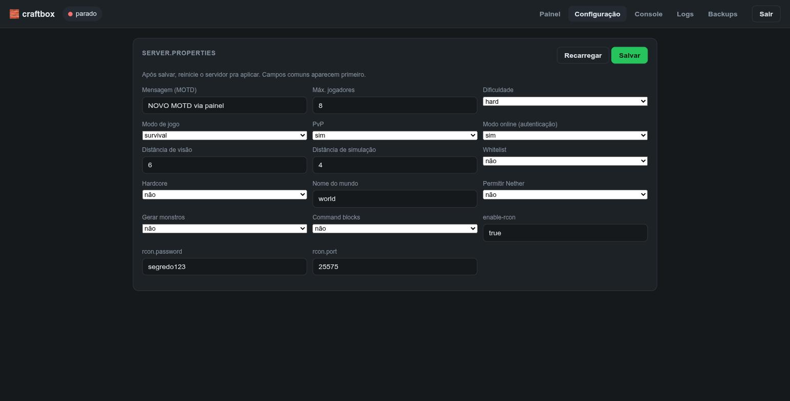
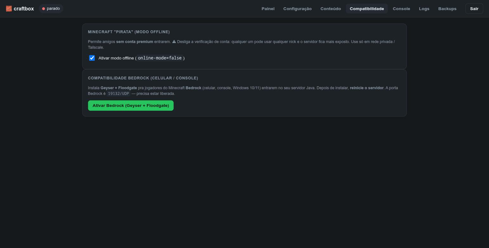

# craftbox-panel

Painel web para **configurar e gerenciar** o servidor Minecraft do craftbox.
Escrito em **Node.js puro, sem nenhuma dependência** (só módulos nativos) — leve
o suficiente pra rodar ao lado do servidor num notebook antigo (~30–40 MB de RAM).

## O que faz

- **Painel** — status (no ar/parado), jogadores online (via RCON), e stats do sistema em tempo real: **frequência da CPU**, RAM, disco, temperatura e load.
- **Ligar / Reiniciar / Desligar** o servidor (via systemd).
- **Configuração** — editor visual do `server.properties` (MOTD, dificuldade, PvP, view-distance, etc.), salva no arquivo.
- **Console** — envia comandos ao servidor em execução via **RCON**.
- **Logs** — últimas linhas do `latest.log`, com auto-atualização.
- **Backups** — lista e dispara o backup do mundo.
- **Conteúdo** — navegador de **mods/plugins do [Modrinth](https://modrinth.com)**: busca e instala/remove com 1 clique (detecta o loader — Fabric→`mods/`, Paper→`plugins/`). Estilo Prism, mas pro servidor.
- **Compatibilidade** — **modo offline** ("pirata", `online-mode=false`) com 1 clique e **Bedrock** (celular/console) via **Geyser + Floodgate**, também em 1 clique.
- **Login por senha** (sessão em cookie assinado).






> **Mods (Fabric) x plugins (Paper):** plugins rodam só no servidor (os amigos usam o Minecraft normal). Mods de conteúdo Fabric precisam ser instalados também no cliente de cada jogador — o painel instala o lado do servidor.

## Instalar no servidor craftbox

No servidor (que já tem o serviço `minecraft` em `/opt/minecraft`):

```bash
sudo pacman -S --needed nodejs        # se ainda não tiver
git clone https://github.com/Vascon11/craftbox.git
cd craftbox/panel
sudo ./setup.sh                       # pede a senha do painel e instala tudo
```

O `setup.sh` copia pra `/opt/craftbox-panel`, cria a senha, configura o `sudoers`
(pra ligar/desligar o serviço), instala o serviço systemd e sobe o painel em
`http://<ip-do-servidor>:8080`.

> **Segurança:** o painel controla o servidor — exponha só na **LAN** ou via
> **Tailscale**, nunca direto na internet. O login é protegido por senha, mas
> mantenha-o fora do alcance público.

## Rodar manualmente (dev/teste)

```bash
node server.js --hash MINHA_SENHA     # gera o hash pra colar no config.json
cp config.example.json config.json    # ajuste port/mcDir/service e cole o "auth"
node server.js                        # sobe em http://localhost:8080
```

## Configuração (`config.json`)

| Campo | Descrição |
|---|---|
| `port` / `host` | Onde o painel escuta (padrão `8080` / `0.0.0.0`). |
| `mcDir` | Pasta do servidor (padrão `/opt/minecraft`). |
| `service` | Nome do serviço systemd (padrão `minecraft`). |
| `rcon` | Host/porta/senha do RCON. Se a senha ficar vazia, é lida do `server.properties`. |
| `auth` | `salt` + `hash` da senha (gere com `--hash`). |
| `sessionSecret` | Segredo pra assinar a sessão (gerado sozinho se vazio). |

O `config.json` guarda o hash da senha e o segredo de sessão — ele **não vai pro
git** (está no `.gitignore`) e fica com permissão `600`.
